## Other Themes

|          Name          |                              Preview                               |
| :--------------------: | :----------------------------------------------------------------: |
|      **redical**       |             |
|       **coral**        |       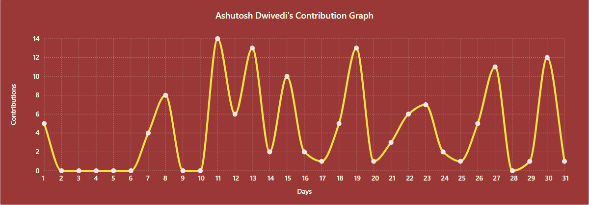        |
|        **nord**        |        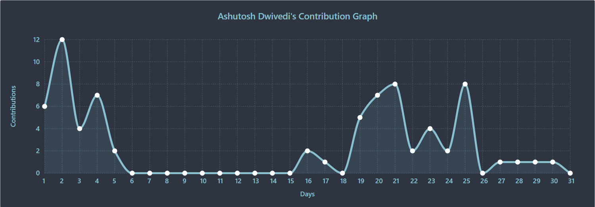        |
|       **lucent**       |       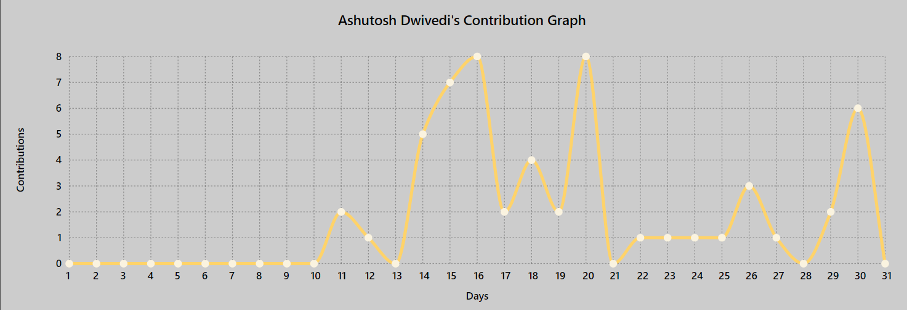       |
|      **dracula**       |      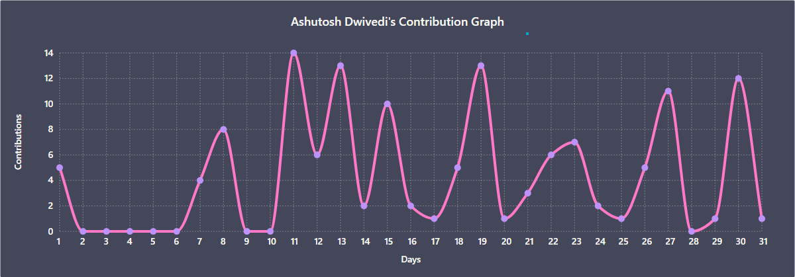       |
|      **gruvbox**       |      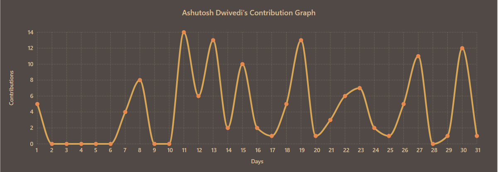       |
|  **chartreuse-dark**   |     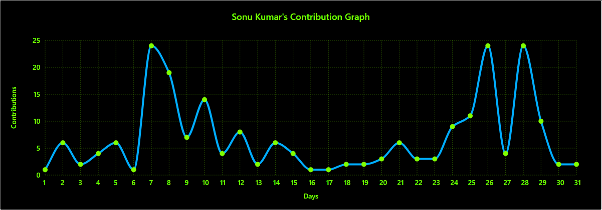     |
|    **github-light**    |    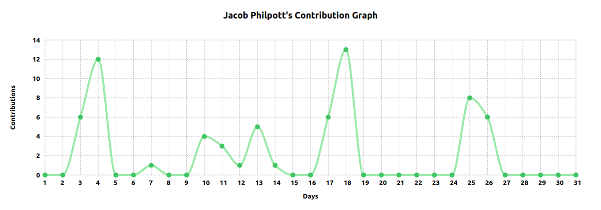    |
|     **github-dark**    |         |
|      **minimal**       |      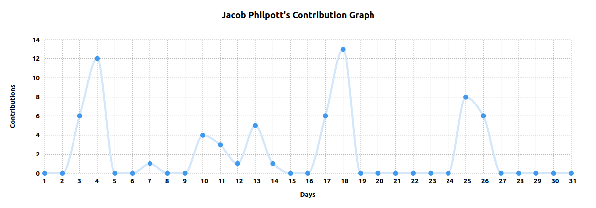       |
| **material-palenight** |  |
|       **green**        |       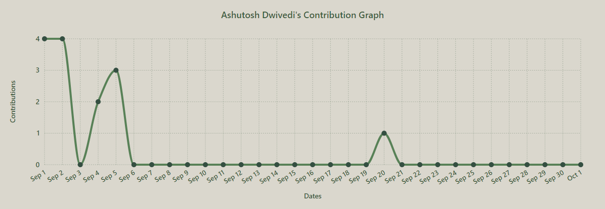        |
|       **gotham**       |              |
|   **noctis-minimus**   |      |
|      **monokai**       |             |
|      **one-dark**      |            |
|      **elegant**       |             | 
|      **aqua**          |                | 
|    **synthwave-84**    |        |
|      **react**         |               |
|      **merko**         |               |
|       **vue**          |                 |
|     **tokyo-day**      |      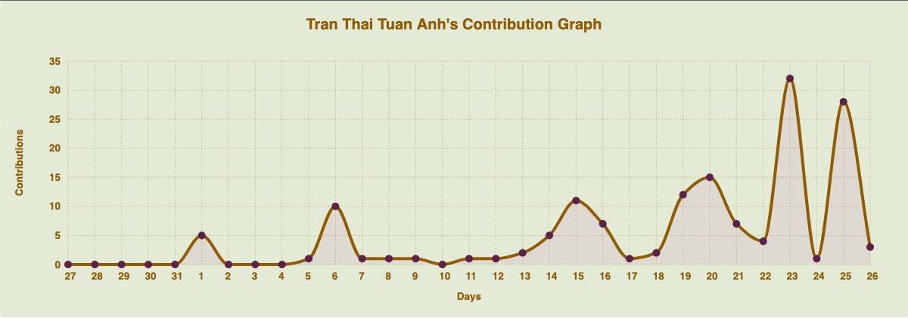     |
|    **tokyo-night**     |         |
|   **high-contrast**    |       |
|      **cobalt**        |        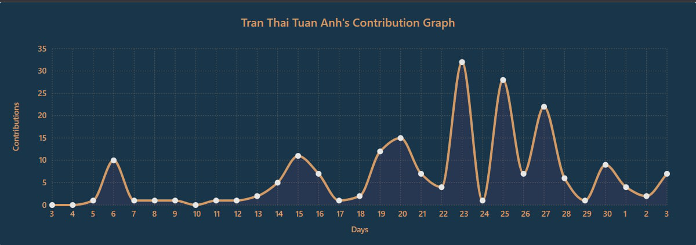      |
|     **material**       |        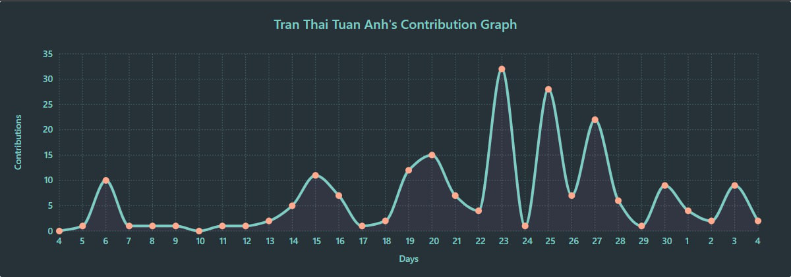    |
|      **nightowl**      |       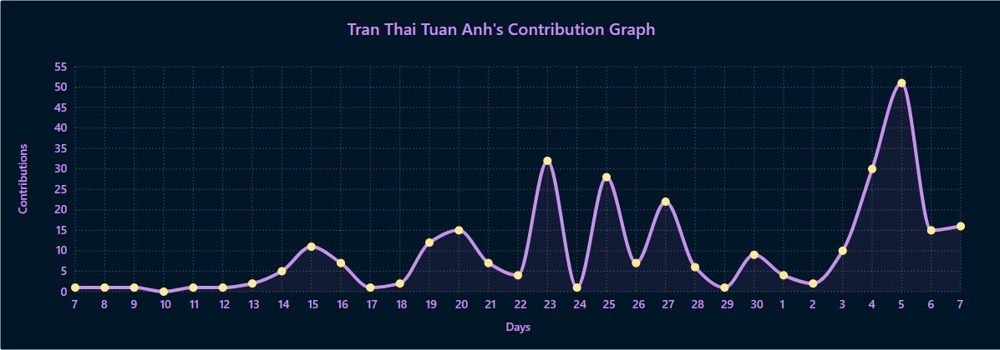     |
|   **modern-lilac**     |    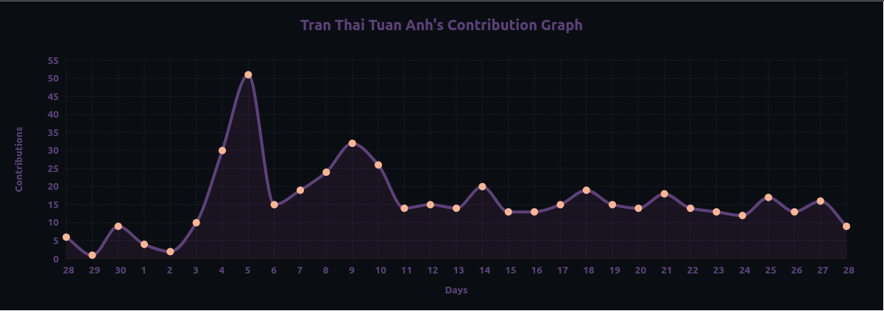    |
|      **arctic**        |    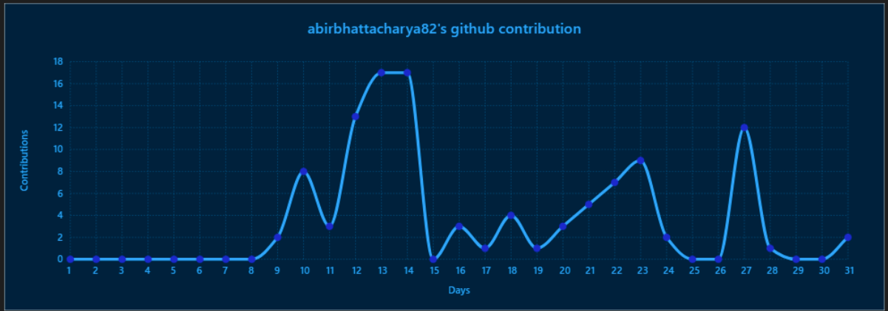          |